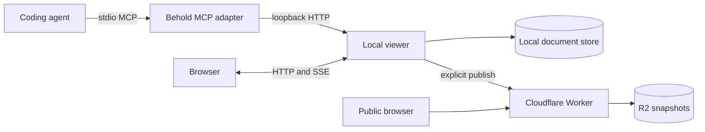

# Behold Architecture

Behold has two separate execution environments: a private local review workspace and an optional public snapshot service.

## System Boundary



Local documents remain on the user's machine. Only an explicit publish action sends a frozen snapshot to the configured Cloudflare Worker.

## Local Runtime

The local viewer is the sole owner of:

- documents and retained revisions
- comments and feedback cursors
- JSON persistence
- browser event streams
- long-poll feedback waiters
- publication receipts and their reconciled remote status

The MCP process is a thin HTTP client. It starts or reuses the viewer, invokes its API, and exits without taking ownership of local state.

Mutating local requests carry `X-Behold-Request: 1`. Combined with loopback binding, strict host validation, and browser origin checks, this blocks cross-site mutation without introducing local accounts or login prompts.

The packaged runtime stores state in the operating system's user data directory. `BEHOLD_DATA_DIR` can override that location. File-backed documents remain at their original paths.

## Browser Application

The Solid application in `src/` renders both local documents and public snapshots. Local-only capabilities, including comments, revisions, file access, and publishing controls, are available only when the local API is present.

Markdown stays portable. Behold adds presentation for semantic fences such as `mermaid`, `tree`, `diff`, `json`, `openapi`, `http`, `terminal`, `schema`, `timeline`, and `definitions`.

## Public Publishing

The Worker in `cloudflare/worker.ts` serves static viewer assets and the snapshot API. It stores snapshots in the `SNAPSHOTS` R2 binding and authenticates writes with `BEHOLD_PUBLISH_TOKEN`.

```text
Local viewer
  -> POST /api/published-documents
  -> Authorization: Bearer <BEHOLD_PUBLISH_TOKEN>
  -> Cloudflare Worker
  -> R2
```

Public reads do not require authentication:

- `GET /api/behold` reports protocol capabilities.
- `GET /api/published-documents` lists snapshots.
- `GET /api/published-documents?slug=<slug>` returns one snapshot.
- `GET /published/<slug>` serves its viewer shell.

Publishing and deletion require the same bearer token. The local viewer keeps that token server-side and exposes browser actions through its loopback-only proxy:

- `POST /api/publish-remote` publishes or updates a snapshot and records a local receipt.
- `DELETE /api/publish-remote` deletes the exact snapshot identified by that receipt.

At startup, the local runtime fetches the public manifest once and reconciles stored receipts. Missing snapshots are marked missing; transport failures are marked unavailable and never mistaken for deletion.

Published payloads are schema-decoded and stripped of local document metadata before storage. Authored Markdown remains unchanged and must be reviewed before publishing.

## One-Click Deployment

The repository root contains everything Cloudflare's deploy flow needs:

- `wrangler.jsonc` defines the Worker, static assets, R2 bucket, and required secret.
- `.dev.vars.example` declares `BEHOLD_PUBLISH_TOKEN` for the setup prompt.
- `package.json` describes the bindings and exposes the deploy command.
- `README.md` links to the Deploy to Cloudflare flow.

Cloudflare clones the public repository, provisions the R2 bucket, prompts for the publish token, builds the viewer, and deploys the Worker into the user's account.

## Security Invariants

- The public Worker never reads the local filesystem.
- Published snapshot metadata never exposes local document IDs or source paths.
- Authored Markdown is published verbatim; users must remove sensitive text before publishing.
- A local deletion never deletes an independently published snapshot.
- Non-loopback file access is denied unless the canonical path is under `BEHOLD_ALLOWED_FILE_ROOTS`.
- Secrets belong in ignored environment files or Cloudflare secret storage, never tracked files.
- Boundary payloads are schema-decoded before use.

## Development

```sh
bun install
bun run test
bun run typecheck
bun run build
```

Use `bun run deploy` only with the intended Cloudflare account selected.
