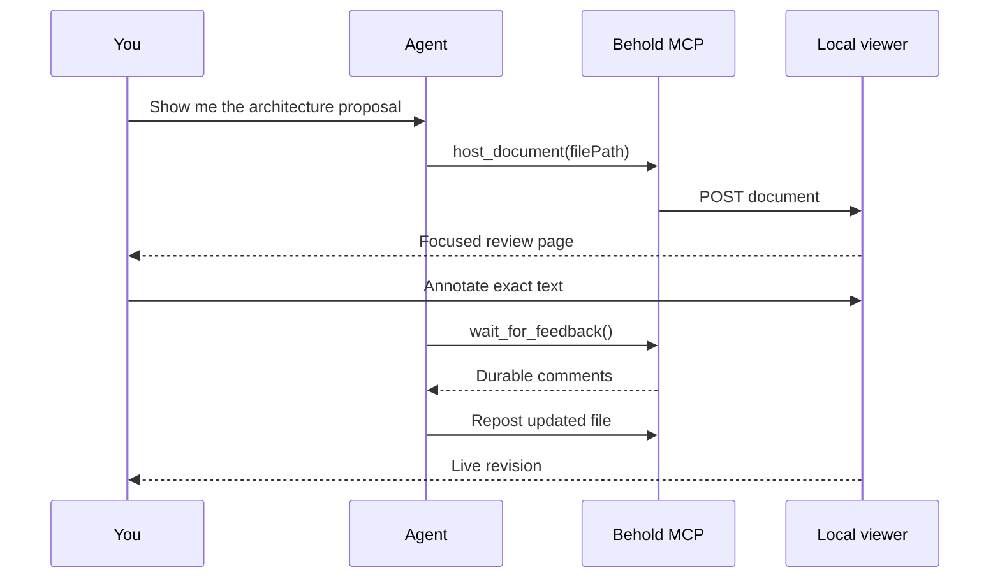
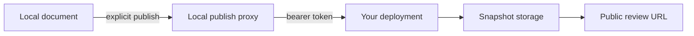

# Behold, end to end

Behold gives a coding agent a **local visual review surface**. The agent hosts portable Markdown; you read, annotate, and compare revisions in the browser; the agent receives that feedback through MCP.

> [!IMPORTANT]
> Local review and public publishing are separate systems. Documents stay on your machine unless you explicitly publish a frozen snapshot through a deployment you configured.

## The whole loop



The browser is not a separate editor or proprietary document format. The source remains ordinary Markdown that can live in a repository, render on GitHub, and survive without Behold.

## 1. Install once

```terminal
$ bunx @kitlangton/behold setup
✓ Detected a supported coding agent
✓ Installed the Behold MCP server
✓ Started http://127.0.0.1:5173
✓ Opened the local viewer
```

Setup registers the MCP server with detected coding agents and starts a reusable local daemon. `behold doctor` verifies both sides of the connection.

```tree
~/Library/Application Support/Behold/
├── store.json        # documents, revisions, comments, feedback cursors
├── runtime.json      # active daemon identity and origins
└── daemon.log        # startup and runtime diagnostics
```

## 2. Ask naturally

You do not need to dictate an API call. Ask your agent to “put this plan in Behold,” “show me this architecture,” or “make this reviewable.” The agent chooses between an inline artifact and a durable file.

```definitions
Hosted document:
  definition: A mutable local review artifact with retained revisions and durable comments.
  aliases: [document]
Inline document: Markdown owned by Behold and updated through the MCP API.
File-backed document: Markdown owned by the project; editing and reposting the same absolute path creates a revision.
Published snapshot: An immutable public export, independent from the local document that produced it.
```

The MCP call is deliberately small:

```typescript title="server/mcp-main.ts" start=204 highlight=207-211 caption="A file-backed document keeps the project file as its source of truth."
const result = yield* client.hostDocument({
  filePath: "/absolute/path/to/docs/proposal.md",
})

yield* Console.log(`Review at ${result.url}`)
```

## 3. Review in the browser

Behold renders prose as a quiet document rather than a dashboard. Headings become an outline; code is highlighted; semantic fences become native visual components; selecting text creates an anchored comment.

The hosted-document boundary is explicit and schema-decoded:

```schema
title: HostedDocument
type: object
required: [id, markdown, revision]
properties:
  id:
    type: string
    description: Stable local document identifier.
  markdown:
    type: string
    description: Portable source text rendered by the viewer.
  sourcePath:
    type: string
    description: Absolute project path for a file-backed document.
  revision:
    type: object
    required: [id, version, createdAt]
    properties:
      id: { type: string }
      version: { type: integer, minimum: 1 }
      createdAt: { type: string, format: date-time }
```

A comment records both a human-readable location and an anchor that can survive nearby edits.

```json
{
  "id": "comment_01JZ9X",
  "content": "Show the failure path before the retry.",
  "status": "open",
  "location": {
    "sectionIndex": 4,
    "startOffset": 118,
    "endOffset": 140,
    "quote": "retry with exponential backoff"
  },
  "anchor": {
    "revisionId": "rev_7",
    "prefix": "The client will ",
    "suffix": " until the budget expires."
  }
}
```

## 4. Iterate without losing context

Reposting the same file path updates the existing document. The viewer retains the current revision plus twenty previous revisions, broadcasts the update over SSE, and keeps comments attached to their source revision.

```timeline
title: A review session
items:
  - time: 09:12
    title: Proposal hosted
    detail: The agent posts docs/proposal.md and opens the stable document URL.
    status: complete
  - time: 09:16
    title: Two comments added
    detail: Feedback is persisted before the waiting MCP call acknowledges it.
    status: complete
  - time: 09:20
    title: Revision 2 arrives
    detail: The same source path updates in place and the browser refreshes live.
    status: current
  - time: Next
    title: Final decision
    detail: Compare the retained diff, resolve comments, and accept the proposal.
    status: pending
```

History is useful because review is about change, not merely the newest text.

```diff
diff --git a/docs/proposal.md b/docs/proposal.md
index 6b271a2..8cd193f 100644
--- a/docs/proposal.md
+++ b/docs/proposal.md
@@ -42,3 +42,7 @@ The worker retries transient failures.
-Retries continue with exponential backoff.
+Before retrying, the worker records the failed attempt and its cause.
+
+Retries use exponential backoff with full jitter and stop when the
+five-minute budget expires.
```

## 5. Use the local API directly when useful

Agents normally use MCP, but the local HTTP API is intentionally straightforward. This exchange hosts inline Markdown:

```http
POST /api/documents HTTP/1.1
Host: 127.0.0.1:5173
Content-Type: application/json
X-Behold-Request: 1

{"markdown":"# Retry policy\n\nPlease review the failure budget."}

HTTP/1.1 201 Created
Content-Type: application/json

{"id":"doc_01JZ9Y","url":"http://127.0.0.1:5173/?document=doc_01JZ9Y"}
```

The same boundary can be described as a compact API reference:

```openapi
openapi: 3.1.0
info:
  title: Behold local document API
  version: 1.0.0
  description: Host portable Markdown and retrieve durable browser feedback.
servers:
  - url: http://127.0.0.1:5173
paths:
  /api/documents:
    post:
      tags: [Documents]
      summary: Host a document
      description: Inline Markdown creates a document; reposting the same absolute file path updates it.
      requestBody:
        required: true
        content:
          application/json:
            schema:
              type: object
              properties:
                markdown: { type: string }
                filePath: { type: string }
      responses:
        "201":
          description: Document hosted
          content:
            application/json:
              schema:
                type: object
                required: [id, url]
                properties:
                  id: { type: string }
                  url: { type: string, format: uri }
        "400": { description: Invalid input }
  /api/documents/{id}/comments:
    get:
      tags: [Feedback]
      summary: List document comments
      parameters:
        - name: id
          in: path
          required: true
          schema: { type: string }
      responses:
        "200": { description: Durable comments }
        "404": { description: Document not found }
```

## 6. Publish only when ready

Publishing exports a frozen snapshot through the local proxy to a deployment you own. Behold removes local document metadata, while authored Markdown is published verbatim. Deleting a local document never deletes an independently published snapshot.



> [!TIP]
> Publishing is optional. Local viewing, comments, revisions, diffs, and feedback work without any cloud account.

## Why the blocks stay semantic

Every rich fence carries information the viewer can present better than generic code, while remaining legible as source:

| Material | Preferred form |
| --- | --- |
| Relationships and flows | `mermaid` |
| Repository structure | `tree` |
| Changes | `diff` |
| Runtime values | `json` |
| API contracts and exchanges | `openapi`, `http` |
| Command output | `terminal` |
| Data shapes | `schema` |
| Chronology | `timeline` |
| Domain language | `definitions` |

The rule is not “decorate everything.” It is: **use the richest semantic representation that makes the material easier to scan**, and use ordinary Markdown everywhere else.
