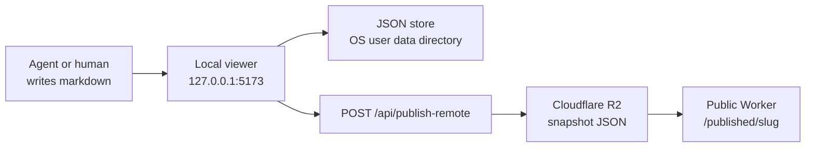
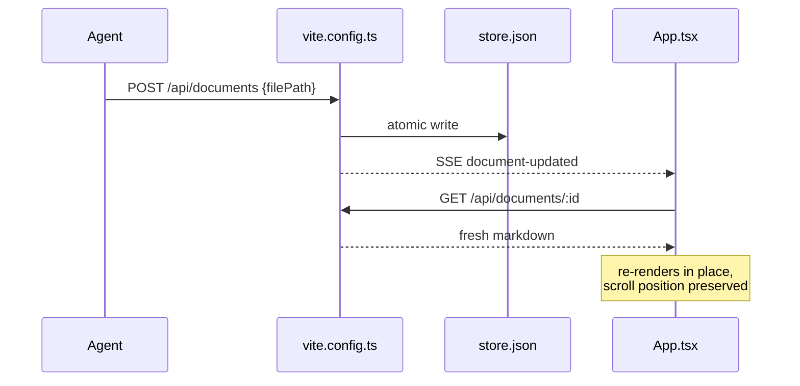
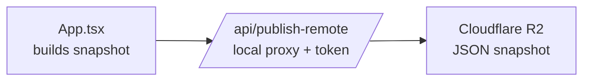

# Behold: A Codebase Tour

This document is a meta example: it is a Behold document, served by Behold, about how Behold is organized. If you can read this, the pipeline works.

## The Big Picture

Behold is a local-first markdown viewer with a publish path to a frozen public snapshot site. One codebase, two personalities:



The left half is private and live. The right half is public and frozen.

## Directory Layout

```tree
behold/
├── src/                  # Solid frontend
│   ├── App.tsx           # the entire UI: rail, viewer, annotations
│   ├── main.tsx          # mount point
│   ├── toast.tsx         # tiny toast store + region
│   ├── index.css         # the entire self-owned dark theme
│   └── lib/
│       ├── comment-anchors.ts   # revision-aware selection capture + projection
│       ├── document-viewer.ts   # Effect v4 runtime, HTTP client, schemas
│       ├── markdown.ts          # safe markdown and fence dispatch
│       ├── rich-blocks.ts       # semantic block renderers
│       ├── highlighter.ts       # lazy Shiki singleton
│       └── published.ts         # published snapshot types + prep
├── server/               # local-only server helpers
│   ├── agent-guide.ts                    # dynamic agent and skill guidance
│   ├── document-api.ts                   # HTTP/SSE adapter over DocumentReviews
│   ├── document-reviews.ts               # Effect domain service + V1/V2 persistence
│   ├── local-file-access.ts              # canonical path authorization
│   ├── local-viewer.ts                   # packaged asset and API server
│   ├── publish-proxy.ts                  # optional remote publishing adapter
│   ├── behold-lifecycle.ts               # daemon discovery, locking, status, and stop
│   ├── behold-setup.ts                   # MCP registration and diagnostics
│   ├── daemon-main.ts                    # persistent packaged viewer daemon
│   ├── behold-cli.ts                     # setup/doctor/lifecycle/MCP commands
│   ├── mcp-main.ts                       # thin Effect v4 stdio MCP HTTP client
│   └── serialized-atomic-json-writer.ts # crash-safe store writes
├── shared/               # packaged schemas shared by browser and server
├── cloudflare/           # public Worker (site + snapshot API)
│   └── worker.ts                        # publish, list, get, published pages
├── vite.config.ts        # development composition
├── test/                 # Vitest regression suite
└── docs/                 # you are here
```

## Who Talks to Whom

The local viewer is the hub. Vite mounts it during development; `server/local-viewer.ts` serves the packaged build. `server/document-api.ts` translates HTTP and SSE while `server/document-reviews.ts` owns revisions, comments, feedback cursors, persistence, and mutation serialization.



Reposting the same `filePath` is idempotent: same document id, updated content, and any open browser tab refreshes itself through the event stream.

## The Frontend

`src/App.tsx` is deliberately one file. The pieces, top to bottom:

- **Sidebar** — open a file, publish, copy agent instructions, recent documents, comments.
- **MarkdownBlock** — renders sanitized HTML from `lib/markdown.ts`, upgrades Mermaid fences client-side, and presents semantic fences as native document components.
- **TableOfContents** — the minimap rail on the right; dashes when idle, labels on hover.
- **CommentPopover** — select text in a hosted revision and create a revision-aware annotation.
- **History rail** — browse retained snapshots or render a derived unified diff between adjacent revisions.

State is plain Solid signals. Async work goes through one `ManagedRuntime` in `lib/document-viewer.ts`:

```ts
// every fetch in the app funnels through this
const result = await runDocumentViewerPromise(loadHostedDocument(id), signal)
```

Effect v4 supplies the HTTP client, schema validation, typed boundary errors, and a bounded request cache. The UI never sees a raw `fetch`.

## The Publish Path

Publishing freezes the current render into a `PublishedDocumentSnapshot` and ships it off:



The public site never touches the local filesystem. The Worker in `cloudflare/worker.ts` reads snapshots from R2, renders the same viewer, and nothing else.

## Agent Workflow

An agent does not have to create a Markdown file before publishing locally. `POST /api/documents` accepts either raw Markdown, JSON `{ markdown }`, or JSON `{ filePath }`. A file is useful when the document should remain a durable project artifact; inline Markdown is useful for an ephemeral review document.

The Effect v4 MCP server in `server/mcp-main.ts` keeps the HTTP API canonical. A coding agent launches it through `server/behold-cli.ts mcp`; it reuses a healthy persistent viewer daemon or starts one before accepting tool calls. MCP exit does not stop the viewer:

```text
+-------------+      +----------------------+      +------------------+
| Agent / MCP | ---> | POST /api/documents  | ---> | Local JSON store |
|             | <--- | comments + cursor    | <--- | Browser review   |
+-------------+      +----------------------+      +------------------+
```

The MCP surface provides `host_document`, `update_document`, `get_document`, `list_documents`, `list_document_versions`, `diff_document_versions`, `wait_for_feedback`, `set_comment_status`, `delete_document`, and `get_agent_guide`. `host_document` deliberately avoids overloading “publish,” which remains the explicit public-snapshot operation.

`wait_for_feedback` is a blocking long-poll, not background behavior by itself. Each comment receives a monotonically increasing sequence. The HTTP API exposes acknowledgement separately, but the current MCP tool acknowledges a returned batch before completing. `/agent-howto`, `/skill`, and `get_agent_guide` serve the current instructions dynamically.

Typed fences keep the document itself portable while giving agents token-efficient render targets:

- `tree` for repository and filesystem structure
- `diff` for code changes
- `json` for structured values
- `mermaid` for diagrams
- `openapi` and `http` for API contracts and exchanges
- `terminal` for ANSI command output
- `schema` for JSON Schema property trees
- `timeline` for chronology
- `definitions` for glossaries

## Persistence Rules

- The local store is one JSON file, written through `serialized-atomic-json-writer.ts`: writes are queued, serialized, and atomic (temp file + rename), so a crash never corrupts the store.
- The versioned V2 store retains the current revision plus 20 previous revisions. Loading a V1 store creates `store.v1.backup.json` before migration.
- New comment anchors retain their immutable origin revision and rendered-text position. Cross-revision placement uses exact quote context and fails closed when duplicate text is ambiguous; exact Markdown offsets and line numbers are stored only when the source quote is unique.
- Product data defaults to the operating system user-data directory and can be overridden with `BEHOLD_DATA_DIR`. File-backed Markdown remains at its original path.
- The MCP process accesses persistence only through HTTP. This prevents the viewer and MCP from racing independent in-memory copies of the store.
- Hosted document deletion removes the document and its comments from that local store. Published Cloudflare snapshots have a separate lifecycle.
- Absolute file paths posted by non-loopback clients must resolve inside `BEHOLD_ALLOWED_FILE_ROOTS` after symlink canonicalization (`local-file-access.ts`).
- Published snapshots are immutable per publish; republishing a slug replaces the stored object atomically.

## Testing

```bash
bun run test        # Vitest regression suite
bun run typecheck   # strict, two tsconfigs
bun run build       # production build
```

The suite covers Markdown rendering, schema decoding, error redaction, cache behavior, write-race safety, and a real MCP/browser-feedback lifecycle on an isolated auto-started viewer.

## Notes

- The browser and MCP runtime use Effect v4 `4.0.0-beta.92`; MCP stdio is supplied by the matching `@effect/platform-bun` package.
- The UI is SolidJS with Kobalte dialog primitives and a hand-authored theme in `index.css`; no Tailwind.
- Mermaid rendering is lazy: the renderer only loads when a document actually contains a mermaid fence.
